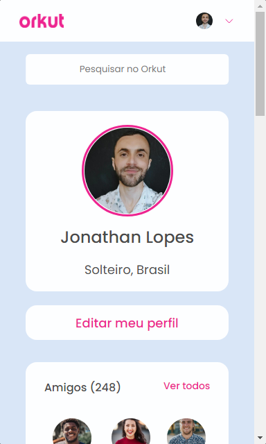
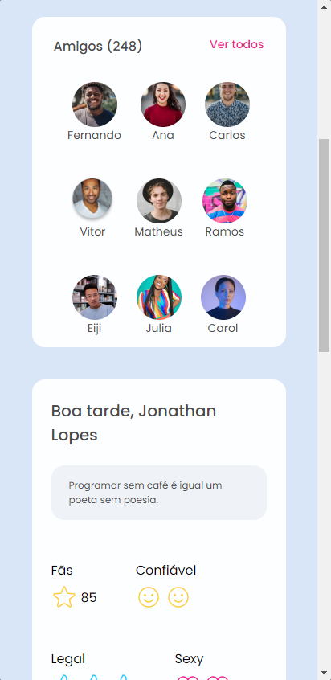
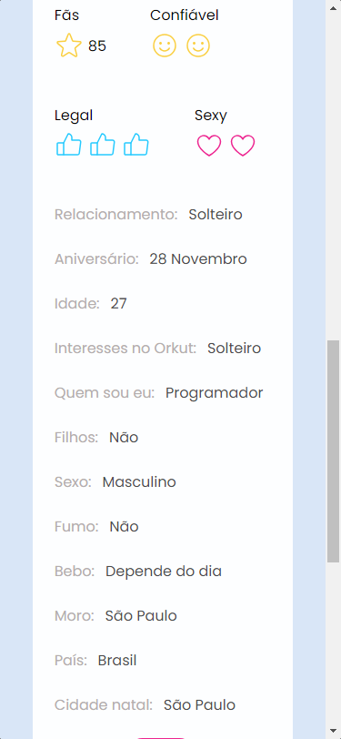
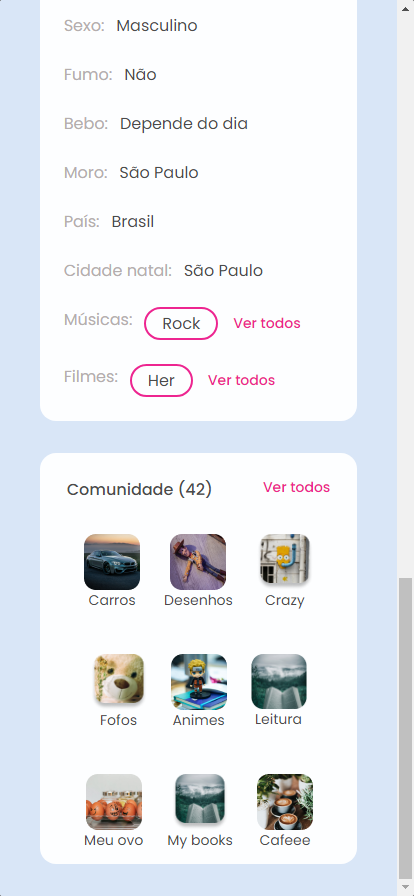
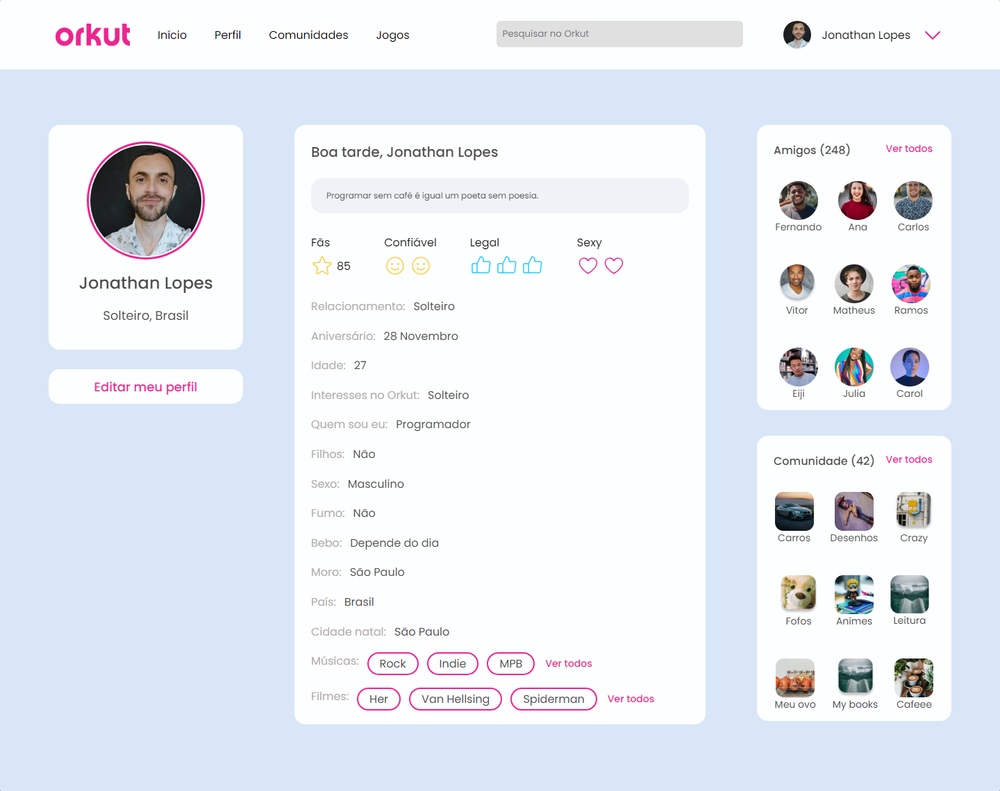

# Orkut

### Descrição

- Essa aplicação se trata de um redesign do Orkut, uma famosa rede social que foi popular no início dos anos 2000. Esta aplicação visa trazer uma nova abordagem para a interface do Orkut, combinando a nostalgia dos antigos usuários com um design moderno e recursos atualizados. O design faz parte de um dos desafios da comunidade Codelândia.

### Objetivo

- Pratica no desenvolvimento de aplicações usando React JS.

### Capturas de tela

### Mobile

  
  
  

### Desktop

### Status

- Finalizado
